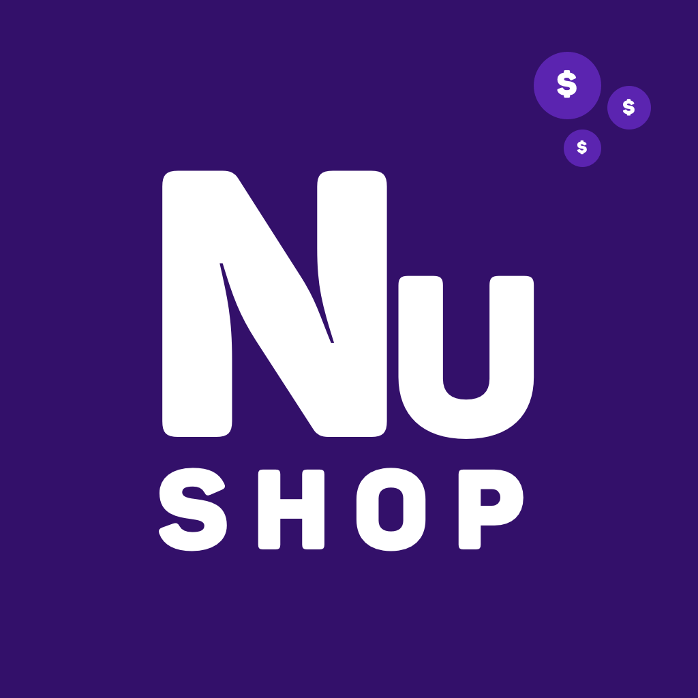
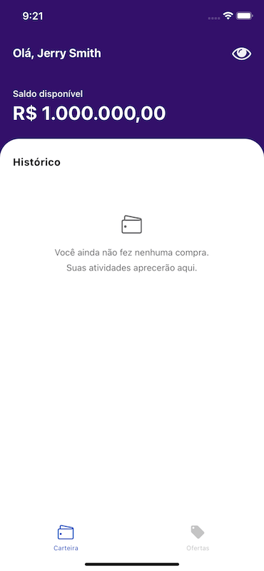
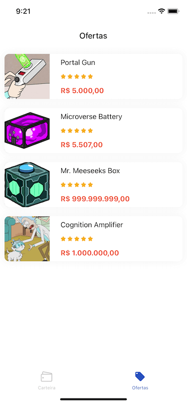
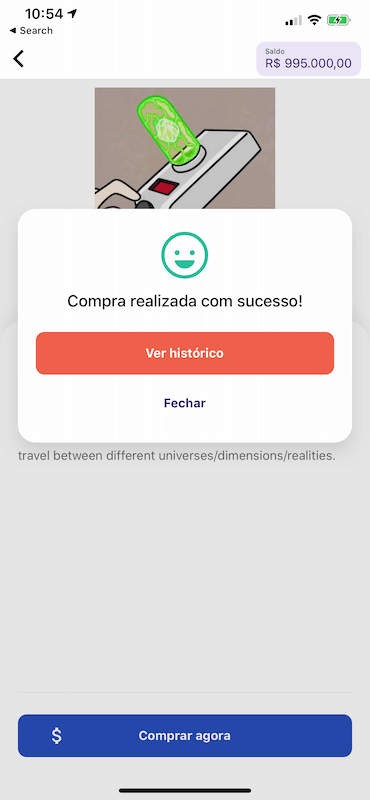
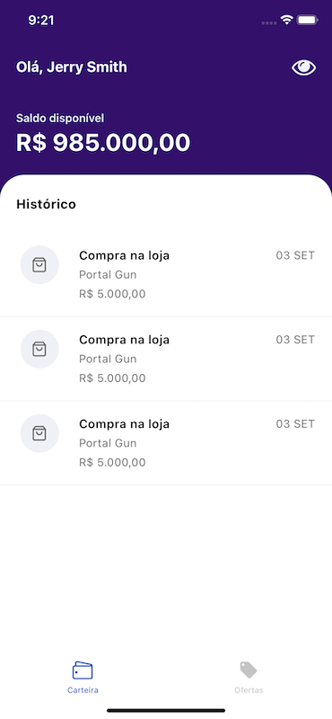
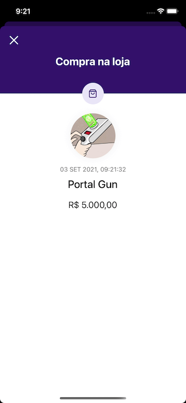
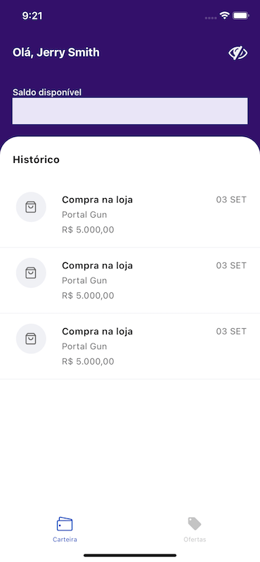

# nushop
<p align="center">
  <a href="#">
    
  </a>
</p>
  <h2 align="center">
   <b>NuShop</b>
  </h2>
  <p align="center">
The NuShop is a solution for a customer to use their balance to make quick purchases of special offers. Transaction is faster than PIX and traditional debit card. Application also shows purchase history.
  </p>

--------

## Technologies
* [React Native](https://reactnative.dev/)
* [Expo](https://expo.dev/)
* [GraphQL](http://graphql.org/)

## Libraries and tools

* [React Navigation](https://reactnavigation.org/) 
> Routing and navigation for Expo and React Native apps.
* [Apollo Client](https://www.apollographql.com/docs/react/integrations/react-native/)
* TypeScript
* Jest
* [Testing library](https://testing-library.com/) for React Native


To run the project you need to follow the installation process below if you don't have the React Native environment.

## Installing Expo CLI

Get Started

```
npm install -g expo-cli

or

yarn global add expo-cli
```

> You can get more details about installation here.(https://docs.expo.dev/workflow/expo-cli/#checking-cli-version)

### Requirements
- [Node.js LTS release](https://nodejs.org/en/)
- [Git](https://git-scm.com/)
- [Watchman](https://facebook.github.io/watchman/docs/install#buildinstall) for macOS users

### Installing dependences 

```
expo install
```

## Starting the development server

```
expo start
```
When you run expo start (or npm start), Expo CLI starts Metro Bundler, which is an HTTP server that compiles the JavaScript code of our app using Babel and serves it to the Expo app. It also pops up Expo Dev Tools, a graphical interface for Expo CLI.

> [Errors and debugging](https://docs.expo.dev/get-started/errors/)


## Opening the app on your phone

- 🍎 On your iPhone or iPad, open the default Apple "Camera" app and scan the QR code you see in the terminal or in Expo Dev Tools.
- 🤖 On your Android device, press "Scan QR Code" on the "Projects" tab of the Expo Go app and scan the QR code you see in the terminal or in Expo Dev Tools. 

### Download Expo app

- [Android](https://play.google.com/store/apps/details?id=host.exp.exponent)
- [iOS](https://apps.apple.com/br/app/expo-go/id982107779)

> The installation step-by-step information is taken from the [official documentation](https://docs.expo.dev/get-started/create-a-new-app/#opening-the-app-on-your-phonetablet).

## Screenshots
### **Wallet**

<span style="border: 1px solid #F4F4F4; ">
    
</span>
<br />

### **Offers**

<span style="border: 1px solid #F4F4F4; ">
    
</span>
<br />

### **Buy Offer**

<span style="border: 1px solid #F4F4F4; ">
    
</span>
<br />

### **Transaction history**

<span style="border: 1px solid #F4F4F4; ">
    
</span>
<br />

### **Transaction details**

<span style="border: 1px solid #F4F4F4; ">
    
</span>
<br />

### **Hide balance**

<span style="border: 1px solid #F4F4F4; ">
    
</span>
<br />

## Show Support
* [Recommend Me On LinkedIn](https://www.linkedin.com/in/cleandersonlobo/) - I will realy Appriciate this
* Don't forget to star ⭐ the repo 😉, it's FREE.

## Author

[Cleanderson Lobo](https://www.linkedin.com/in/cleandersonlobo/)


> *Enjoy this solution that was made with great care.*